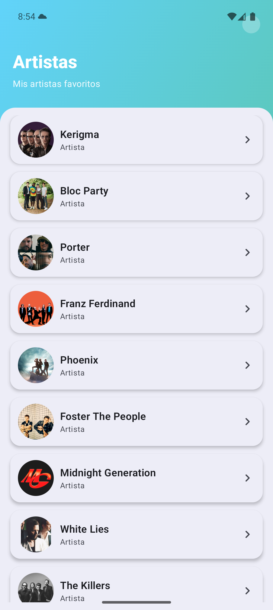
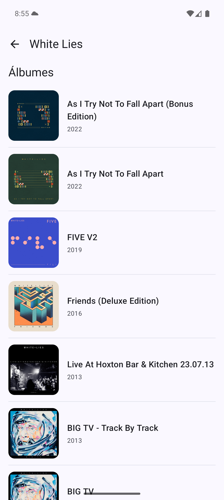
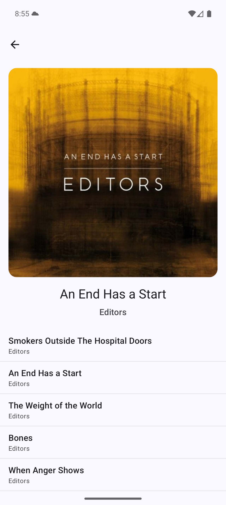

# MyMusic by Heriberto Martinez

App Android (Kotlin + Jetpack Compose) que consume la **Spotify Web API** con el flujo de **artistas → álbumes → canciones**.  
Arquitectura **Clean + MVVM**, corrutinas, **Hilt**, **Retrofit/Moshi**, **Paging** (álbumes), **Navigation** y **Coil**.

---

## 1) Requisitos

- **Android Studio** (recomendado: versión estable más reciente).
- **JDK 17** (Android Studio suele traer uno embebido).
- **Git** (para clonar el repositorio).
- **Cuenta de Spotify for Developers** (gratis) para obtener **Client ID** y **Client Secret**.

Opcional:
- **Emulador Android** (Pixel 5 / API 34+), o un **dispositivo físico** con Android 7.0+.

---

## 2) Clonar y abrir el proyecto

```bash
git clone https://github.com/HeribertoME/MyMusic.git
cd MyMusic
```

- Abre el folder en **Android Studio**.
- La primera vez, Android Studio descargará dependencias y configurará el SDK automáticamente.

---

## 3) Configurar credenciales de Spotify

La app usa el **Client Credentials Flow** de Spotify: toma un **access token** en tiempo de ejecución con el `client_id` y `client_secret`.

**Documentación oficial:** https://developer.spotify.com/documentation/web-api  
Guía de inicio: https://developer.spotify.com/documentation/web-api/tutorials/getting-started

1. Crea una app en el **Spotify Developer Dashboard** y copia:
   - `Client ID`
   - `Client Secret`

2. En el archivo **`local.properties`** (en la raíz del proyecto), añade:

```
SPOTIFY_CLIENT_ID=tu_client_id_aqui
SPOTIFY_CLIENT_SECRET=tu_client_secret_aqui
```

> ⚠️ `local.properties` **no** se versiona. Así se mantienen las credenciales fuera del repo.

3. La configuración de red (Retrofit/OkHttp) leerá estas propiedades para pedir el token a `https://accounts.spotify.com/api/token` y luego llamar a `https://api.spotify.com/v1/...`.

---

## 4) Compilar y ejecutar

- Selecciona un **dispositivo** (emulador o físico).
- En Android Studio, pulsa **Run ▶**.

Compatibilidad:
- **minSdk = 24**
- **targetSdk / compileSdk = 36**
- Kotlin **2.0.21**, AGP **8.13.0**

---

## 5) ¿Qué puedo probar dentro de la app?

1. **Artistas**: lista de **artistas fijos** (elegí un listado de mis artistas favoritos).
2. **Álbumes**: al tocar un artista se navega a sus álbumes (lista **paginada** con `limit/offset`).
3. **Canciones**: al tocar un álbum se muestra la portada grande, el nombre del álbum y artista, y debajo la lista de canciones (sin paging en UI; el repositorio pagina internamente hasta traer todas).

> Si no ves imágenes/álbumes:
> - Revisa que `SPOTIFY_CLIENT_ID/SECRET` estén correctos.
> - Tu red permita llamadas HTTPS salientes.
> - Reintenta desde el botón “Reintentar” en estados de error.

---

## 6) Estructura del proyecto (resumen)

```
app/
 ├─ data/
 │   ├─ datasource/
 │   │   └─ remote/
 │   │       ├─ network/
 │   │       │   ├─ api/            (SpotifyApi)
 │   │       │   ├─ config/         (ApiCall, interceptores, autenticador)
 │   │       │   └─ responses/      (DTOs de Spotify + Moshi)
 │   │       └─ RemoteDataSource.kt / Impl
 │   ├─ mapper/                      (DTO -> Domain)
 │   └─ repository/                  (ArtistRepositoryImpl, AlbumRepositoryImpl)
 ├─ domain/
 │   ├─ model/                       (Artist, Album, Track)
 │   ├─ repository/                  (interfaces dominio)
 │   └─ usecase/                     (GetArtists, GetArtistAlbumsPaged, GetAlbumTracks)
 ├─ di/                              (Hilt modules: Network, DataSource, Repository)
 ├─ presentation/
 │   └─ ui/
 │       ├─ components/              (Cards, states, skeletons)
 │       └─ screens/
 │           ├─ artists/             (ArtistRoute/Screen/ViewModel)
 │           ├─ albums/              (AlbumsRoute/Screen/ViewModel)
 │           └─ tracks/              (TracksRoute/Screen/ViewModel)
 └─ ui/theme/                        (Material3 + colores)
```

Tecnologías clave:
- **Compose Material 3** (UI)
- **Navigation Compose**
- **Coil** (imágenes)
- **Retrofit + Moshi + OkHttp** (network)
- **Hilt** (DI)
- **Coroutines/Flow** (asíncrono)
- **Paging 3** (álbumes)
- **JUnit/MockK/Turbine** (unit tests)
- **Compose UI Test & MockWebServer** (UI + red fake)

---

## 7) Variables y build

- `build.gradle.kts` ya está configurado con:
  - Hilt (kapt/ksp según módulo)
  - Paging (`runtime` + `compose`)
  - Retrofit/Moshi/OkHttp
  - Compose BOM y Material3
- **INTERNET permission** incluida en `AndroidManifest.xml` (necesaria para Spotify).

---

## 8) Ejecutar pruebas

### 8.1 Unit tests
Desde Android Studio: **Run > Run ‘All Tests’** o:
```bash
./gradlew testDebugUnitTest
```

Incluye:
- **Mappers** (DTO → Dominio)
- **UseCases**
- **ViewModels** (con regla `MainDispatcherRule`)
- **PagingSource** (álbumes)
- Repositorio de **tracks** concatenando páginas

### 8.2 UI tests (Compose)
En Android Studio:
- Selecciona una **configuración de Instrumented Tests** y ejecuta.
o por terminal:
```bash
./gradlew connectedDebugAndroidTest
```

Se incluyen pruebas de la pantalla **Tracks** (estados de loading, error con retry, contenido y scroll).

### 8.3 Tests de red con MockWebServer
Se realizaron pruebas de:
- Parseo de respuestas de Spotify (`SpotifyApi`)
- Envío de **Authorization: Bearer ...** por el interceptor
- Manejo de errores (ej. 401 → mensaje “Invalid access token”)

---

## 9) Troubleshooting

- **401 Invalid access token**
  - Verifica `SPOTIFY_CLIENT_ID/SECRET` en `local.properties`.
  - Spotify invalida tokens caducados; la app solicita un token nuevo automáticamente.
- **No compila por Hilt/KSP/Kapt**
  - Sincroniza Gradle (**Sync Project**).
  - Asegúrate de aplicar el plugin Hilt en el módulo `app` y `alias(libs.plugins.hilt) apply false` a nivel de proyecto.

---

## 10) Decisiones de diseño

- **Clean + MVVM** para separar UI, casos de uso, datos y red.
- **Client Credentials Flow** para simplicidad (no se requiere login de usuario).
- **Paging** solo donde aporta (álbumes por artista).
- **UI tipo Spotify**: cabeceras limpias, tarjetas con imagen, listas verticales.

---

## 11) Scripts útiles

- **Limpiar y compilar**:
  ```bash
  ./gradlew clean assembleDebug
  ```
---

## 12) Licencia

Proyecto con fines de evaluación técnica.

---

## 13) Preview

A continuación se muestran capturas de la app para ilustrar el flujo **Artistas → Álbumes → Canciones**.

### Ejemplos

**Pantallas principales**

| Artistas | Álbumes | Canciones |
|---|---|---|
|  |  |  |
